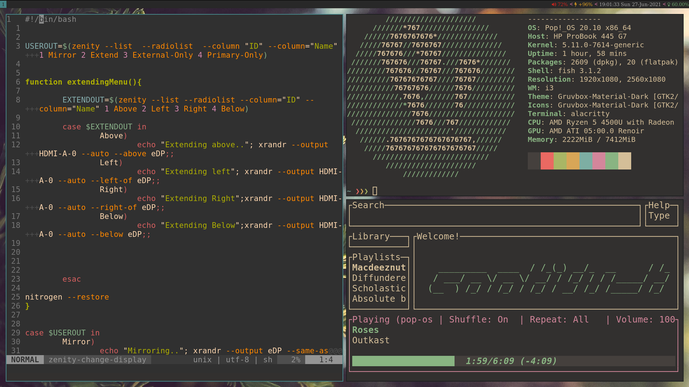
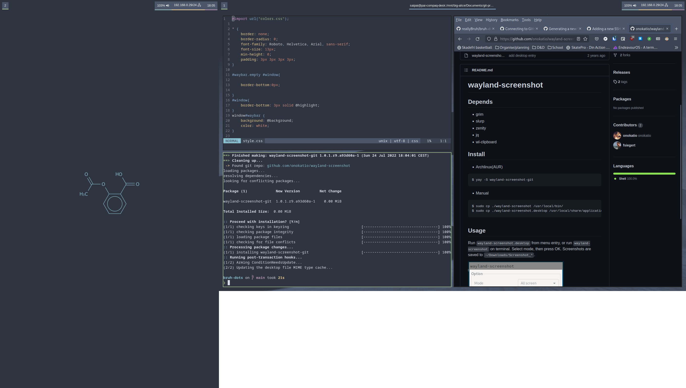
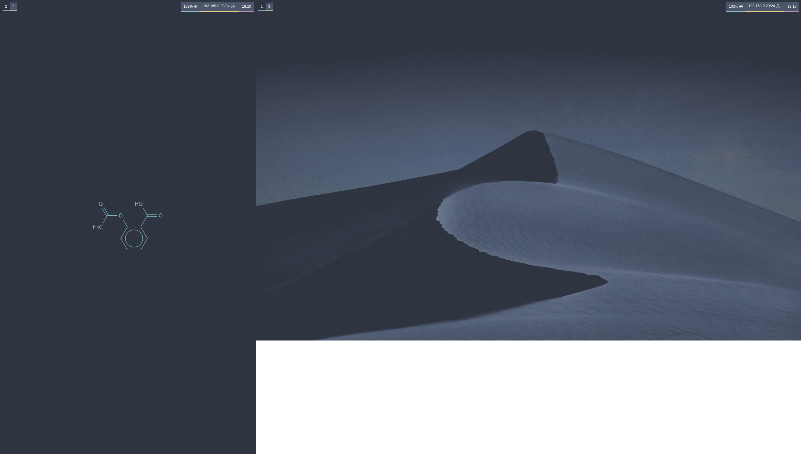

# Readme

Welcome to the repository where you can find all my config-, custom-script- and dot-files.

After spending (what feels like) eternity, this is how my window manager looks:

## i3wm config 

*(Not in use, I lost all my files from this configuration.)*

## Swaywm config (wayland)

This configuration is from Sway, a wayland compositing window manager

I use the theme called *Nord* for the configuration.

